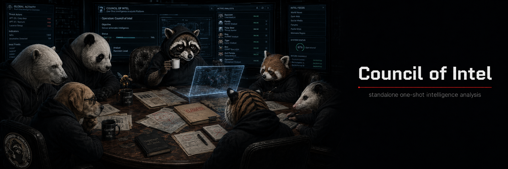

# council-of-intel



App standalone de deliberación multi-LLM para análisis de inteligencia.

Inspirada en el [Council of LLMs de Andrej Karpathy](https://github.com/karpathy/LLM-Council), pero en vez de personalidades genéricas, el consejo está formado por figuras del mundo de la inteligencia: analistas IC, teóricos de warning intelligence, pensadores estratégicos del mundo clásico y arquetipos de las SATs. La pregunta que le haces al consejo es una pregunta de inteligencia. El consejo delibera una sola vez (Round 0–4) y devuelve un Stage Final estructurado.

Lo hice como un challenge personal porque me apetecía y porque pude.

---

## Qué hace

Planteas una pregunta de inteligencia. Los seats deliberan de forma asíncrona y paralela. En Round 2 se examinan entre ellos. El Chairman (McLaughlin) sintetiza, pondera el dissent y emite un Stage Final con razonamiento explícito, formulación recomendada y disensiones registradas.

No es un chatbot. No hay turnos. No hay follow-up. Una sesión, un análisis, un entregable.

---

## Las 17 personalidades

El catálogo cerrado tiene 17 personalidades en cuatro familias.

**Familia A — SATs (modo SATs):** arquetipos de las Structured Analytic Techniques. Cada seat produce un entregable estructurado distinto, no prosa analítica genérica.

| ID | Nombre | Output |
|----|--------|--------|
| `ach-analyst` | ACH Analyst | Matriz hipótesis × evidencia con discriminadores |
| `red-team` | Red Team | Ruta del adversario, ángulo de engaño, contraindicadores |
| `attribution-skeptic` | Attribution Skeptic | Tabla de 6 clases de evidencia; bloquea atribución si no convergen 3 |
| `devils-advocate` | Devil's Advocate | Mejor caso para la hipótesis minoritaria con tests que la matan |
| `key-assumptions-checker` | Key Assumptions Checker | Tabla de supuestos con fragilidad y señal de ruptura |
| `quality-of-info-auditor` | Quality of Info Auditor | Rúbrica Admiralty por fuente; detecta circularidad |
| `indicators-of-change` | Indicators of Change | Indicadores con umbral, fuente, timing y disparador de revisión |

**Familia B — Doctrinarios IC (modo Council):** cada seat aporta una lente metodológica distinta.

| ID | Figura | Lente |
|----|--------|-------|
| `kent` | Sherman Kent | Lenguaje probabilístico calibrado; auditoría de calificadores verbales |
| `heuer` | Richards Heuer | Sesgos cognitivos activos en el análisis, con tests de refutación |
| `clark` | Robert Clark | Modelo target-centric: subsistemas, relaciones, nodos de alta palanca |
| `lowenthal` | Mark Lowenthal | Utilidad para el consumidor IC; detección de contaminación política |
| `grabo` | Cynthia Grabo | Warning intelligence: indicadores anticipatorios, umbral de alerta |

**Familia C — Cognitivos/Estratégicos (modo Council):** polaridad cognitiva distinta por seat.

| ID | Figura | Rol |
|----|--------|-----|
| `feynman` | Richard Feynman | Mecanismo causal, cadena causa-efecto, predicciones falsables |
| `socrates` | Sócrates | Ataque a premisas, contradicción interna, juicio provisional obligatorio |
| `sun-tzu` | Sun Tzu | Intención del adversario, engaño activo, timing estratégico |
| `lao-tzu` | Lao Tzu | Patrones emergentes, efectos de segundo orden, umbral de revisión activo |

**Familia D — Chairman canónico**

| ID | Figura | Rol |
|----|--------|-----|
| `mclaughlin` | John McLaughlin | Síntesis, ponderación de dissent, Stage Final estructurado |

---

## Modos

**SATs** — hasta 7 seats de Familia A + Chairman. Emite anexos doctrinales estructurados (matrices ACH, rúbricas Admiralty, tablas de indicadores). Sin prosa genérica.

**Council** — hasta 9 seats de Familias B y C + Chairman. Orientado a contraste metodológico, warning intelligence y pensamiento de primeros principios.

---

## Output

```
# Stage Final: Council Answer

[Opciones consideradas y descartadas]
[Razonamiento de la opción elegida]
[Formulación recomendada]
[Conclusión con confianza calibrada]

Dissent registrado: [...]

[Anexos SAT si aplica]

---
Metadatos: modo, seats, modelos, duración, coste estimado
```

Las sesiones se persisten como JSON en `sessions/` e indexan en SQLite.

---

## Requisitos

- API key de [OpenRouter](https://openrouter.ai) con crédito disponible.
- Para la distribución: Windows (onedir).
- Para desarrollo: Python 3.12+, `uv`, Node 20+.

---

## Instalación (distribución Windows)

1. Descomprime `dist/council-of-intel-v0.1.0-windows-onedir.zip`.
2. Crea `.env` en la carpeta extraída:

   ```
   OPENROUTER_API_KEY=sk-or-v1-...
   ```

3. Valida:

   ```powershell
   .\council-of-intel.exe --dry-run
   ```

---

## Uso

```powershell
.\council-of-intel.exe --web    # interfaz web (recomendada)
.\council-of-intel.exe --tui    # terminal
.\council-of-intel.exe          # menú [1] TUI  [2] Web  [3] Dry-run
```

---

## Configuración

`config.yaml` controla la whitelist de modelos, el Chairman, los umbrales de anti-convergencia y los parámetros del servidor. Modelos validados en v0.1.0:

```
anthropic/claude-opus-4.7
anthropic/claude-sonnet-4.6
openai/gpt-5.5
google/gemini-3.1-pro-preview
x-ai/grok-4.3
deepseek/deepseek-v3.2
meta-llama/llama-3.3-70b-instruct
```

---

## Desarrollo

```bash
# Backend
uv sync
uv run pytest -q
uv run ruff check src tests

# Frontend
cd frontend && npm install --ignore-scripts
node node_modules/typescript/bin/tsc -b
node node_modules/eslint/bin/eslint.js .

# Dev backend (demo sin OpenRouter)
uv run uvicorn council_of_intel.api.dev_app:app --host 127.0.0.1 --port 8000

# Dev frontend (proxy /api → 8000)
cd frontend && node node_modules/vite/bin/vite.js --host 127.0.0.1 --port 5173

# Dev backend con OpenRouter real
COUNCIL_WEB_REAL_OPENROUTER=1 uv run uvicorn council_of_intel.api.dev_app:app --host 127.0.0.1 --port 8000
```

---

## Documentación adicional

- `docs/NEXT_STEPS.md` — work order de Fase 12
- `docs/PERSONALITY_AUDIT.md` — auditoría del catálogo
- `docs/errors.md` — catálogo de códigos de error
- `docs/AUDIT.md`, `docs/SBOM.md`, `docs/THREAT_MODEL.md`, `docs/RGPD.md` — auditoría global v0.1.0
- `spec/` — especificaciones de diseño
- `RELEASE_NOTES.md`, `CHANGELOG.md` — historial de versiones

---

## Limitaciones conocidas (v0.1.0)

- Distribución solo para Windows (onedir).
- Vitest y Vite dev requieren entorno sin sandbox.
- `npm audit` reporta 5 vulnerabilidades moderadas en la cadena dev de vitest/esbuild; no afectan al bundle de producción.
